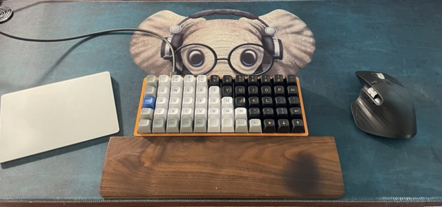

# Preonic custom hardwar and firmware config

*Created 08/23/21*  
*Last updated 05/14/22*

- [Overview](#overview)
- [Hardware](#hardware)
  - [PCB and Case](#pcb-and-case)
  - [Switches](#switches)
  - [Keycaps](#keycaps)
- [Firmware](#firmware)
  - [Layer 1](#layer-1)
  - [Layer 2](#layer-2)
  - [Layer 3](#layer-3)
  - [Layer 4](#layer-4)
- [Installation Notes](#installation-notes)
- [Development Steps](#development-steps)
- [References](#references)

## Overview
This a custom 4 layer setup for the Preonic ortholinear keyboard. Features:
- Base layer for normal typing
- Quick toggleable decond layer for vim like movement (hjkl) + easier symbols
- Third layer dedicated to window management and screenshotting key combos
- Fourth special musical keyboard layer

## Hardware
### PCB and Case
[OLKB](https://olkb.com/) Preonic with aluminum case

### Switches
- Kailh Speed silvers (top 4 rows)
  - Linear, light-weight for regular typing with thick keycaps because keypresses are registered about halfway as you press down a key. Takes a bit to get used to it, but once you do it's a great "feathery" or "floaty" typing feeling.
- Kailh Box Pale Blue (last row)
  - Tactile clicky because it's mapped to a layer toggle
- Kailh Box white (last row)
  - Tactile clicky because it's mapped to a layer toggle
- Cherry mx reds (last row)
  - Linear like the silvers, but a tiny bit heavier and don't register a keypress so lightly. Great for key that your rest your thumbs on, as you won't accidentally register a keypress like the silvers.

### Keycaps
- Drop MT3 Camillo Ortho set (grey, white, blue)
- Drop MT3 Skiidata Ortho set (black, orange)

## Firmware

### Layer 1
Normalish typing with vim like movement (hjkl), space/backspace on thumbs, and layer 2 quick-toggle on Esc  

### Layer 2
Easier access to common symbols (e.g brackets) and command modifiers (e.g. shift)   

### Layer 3
Primarily for window management with [Rectangle](https://rectangleapp.com/)  

### Layer 4
A special layer that can toggle a musical keyboard. To activate:  
1. Start on layer 1 (base)
2. *RSE* (last row, fifth from the right): this moves to layer 2
3. *GREY ENTER* (last row, fourth from the right): this moves to layer 4
4. *GREY ENTER* (same key as above): this turns on/off music mode. All keys in this mode musical notes except:
    - *GREY ENTER*: this toggles music mode on/off 
    - *BLACK DIAMOND*: this changes the scale of the keyboard (e.g. chromatic)

To turn off the musical keyboard and return to layer 1 just press:
1. *GREY ENTER*: turn off music mode
2. *RSE*: move to layer 1

## Installation Notes   
- After installing `qmk` from homebrew, all the files below will live inside `~/qmk_firmware/keyboards/preonic/keymaps`
- Clone this repo into that directory (this avoids forking the entire QMK firmware and just retains the config files)

## Development Steps  
1. Install qmk: `brew install qmk/qmk/qmk`
2. Setup qmk: `qmk setup`
3. Set preonic to default keyboard: `qmk config user.keyboard=preonic/rev3`
4. Set me as default user: `qmk config user.keymap=ejolly`
5. Create new preonic profile by duplicating default: `qmk new-keymap` (name it `ejolly`)
6. Visually setup and dowload keymap file from `https://config.qmk.fm`
7. Convert downloaded file to `keymap.c`: `qmk json2c filename.json > keymap.c`
8. Move converted file overwriting default: `mv keymap.c ~/qmk_firmware/keyboards/preonic/keymaps/ejolly/keymap.c`
9. Adjust additional config like music mode and timing in `config.h` and `rules.mk`
10. Compile: `qmk compile -km ejolly`
11. Flash the resulting `.bin` file using QMK Toolbox
12. On updates might need to `qmk clean` and restart terminal before running another `qmk compile`

## References  
[QMK Configurator](https://config.qmk.fm/#/)

[QMK Toolbox](https://github.com/qmk/qmk_toolbox)

[QMK Music Mode](https://beta.doc.qmk.fm/using-qmk/hardware-features/feature_audio#music-map)   

[Full keycode list](https://beta.doc.qmk.fm/using-qmk/simple-keycodes/keycodes) 

[Tapping/mod settings](https://beta.docs.qmk.fm/using-qmk/software-features/tap_hold) 

[Nice blog post on mod key settings](https://precondition.github.io/home-row-mods#using-home-row-mods-with-qmk)

[Testing timing of dual mod keys](https://precondition.github.io/home-row-mods#tapping-term-test-area)